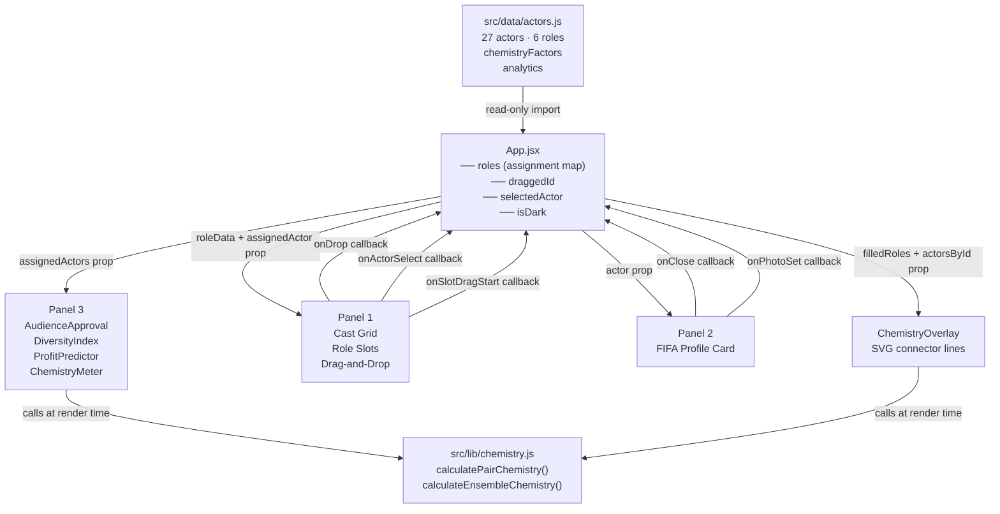

# Project Echoes — Casting Sandbox
### AI 201 · Project 2 · Milind Murthy

**Live Site:** https://mmurth21.github.io/Casting-Dashboard/

A three-panel reactive casting dashboard for a fictional Disney/Lucasfilm production — *Echoes of the Force.* All three panels share a single centralized state object. Interactions in one panel update the others in real time.

---

## What You Turn In

### Live Reactive Sandbox
**URL:** https://mmurth21.github.io/Casting-Dashboard/

Three connected, interactive UI components sharing centralized state hosted on GitHub Pages:

- **Panel 1 — The Browser:** Diamond-grid cast board with drag-and-drop role assignment, talent pool, cost cap bar, and chemistry connector lines between filled slots.
- **Panel 2 — The Card:** FIFA-style actor profile card (photo drop, tape notes, strengths, press articles) triggered by clicking any actor in Panel 1.
- **Panel 3 — Executive Summary:** Floating sidebar with live Audience Approval gauge, Diversity Index, AI Profit Predictor, and Cast Chemistry meter — all reactive to the current cast.

Clicking or dragging in Panel 1 updates Panel 2 and Panel 3 simultaneously. No page refresh required.

---

### Design Intent

**Domain:** Theatrical casting for a Star Wars sequel — *Echoes of the Force.* Chosen because casting is a high-stakes, opinionated, data-rich domain where the tension between creative instinct and hard constraints (budget, availability, public sentiment) maps naturally onto a multi-panel reactive UI.

**Data Model:** A flat actor schema in `src/data/actors.js` — top-level `id`, `name`, `role`, `stats` (rtScore, cost, divaRating), `background` (ethnicity, currentEvents), `metadata` (tapeNotes, type, agency, strengths, genreExperience, articles), and `chemistryFactors` (originRegion, trainingLineage, actingEthos, pastCollaborations, publicSentiment, franchiseOverlap, ageBracket). 27 actors across 6 roles. Daisy Ridley is locked as Rey Skywalker and cannot be moved.

**Visual Rules:**
- Light mode ("The Brief"): gallery aesthetic — warm off-whites, Playfair Display serif numbers, minimal chrome.
- Dark mode ("The Film"): deep navy galaxy stage, gold Cinzel Decorative title, X-wing cursor, lightsaber cost bar, starfield background.
- Role accent colors are constants (`ROLE_ACCENT` in `App.jsx`): blue for Kaelen Sol/Chancellor, red for Jaxen Vane/Vaneen Kor, yellow for T-0. These colors drive slot borders, glow effects, Panel 2 chip shadows, and chemistry line strokes.
- Chemistry line weight: 3px for green/red (strong signal), 2px for yellow (neutral). All lines at 0.75 opacity, round linecap.

**State Flow:** Single `roles` object in `App.jsx` keyed by role name. All derived values (`assignedActors`, `currentTotal`, `filledRoles` for the overlay) are computed inline from that one object. Panel 3 receives `assignedActors` as a prop. Panel 2 receives a single `actor` object. Nothing is duplicated.

---

### Mermaid Diagram

---

### AI Direction Log

**Entry 1 — GitHub Pages Deployment**
Asked AI to deploy the project to GitHub Pages using `gh-pages`. AI produced a working deployment but with an all-lowercase base path (`/casting-dashboard/`). I caught that the GitHub repo is `Casting-Dashboard` (capital C and D) — Linux servers are case-sensitive, so assets 404'd. Corrected the base to `/Casting-Dashboard/` and redeployed. Also caught that `BrowserRouter` would 404 on direct navigation under static hosting and directed the switch to `HashRouter`. AI had suggested the 404.html redirect trick; I rejected that in favor of HashRouter since URL aesthetics don't matter for a portfolio project and HashRouter is more reliable.

**Entry 2 — Chemistry Data & Logic (Session A)**
Provided AI with an exact spec: 7 `chemistryFactors` fields per actor, precise factor weights (pastCollaboration ±25, divaDelta −15/−8, ethosClash −12, trainingOverlap +10, originOverlap +6, franchiseOverlap +6, sentimentRisk capped −10, ageGapFlag −10 romantic-only), baseline 60, tier thresholds. Also specified the exact return shape: `{ score, tier, factors[] }` with `name`, `weight`, `contribution`, `note` per factor. AI implemented this correctly on first pass. What I added: the decision that `ageGapFlag` should be gated by a `context.romanticPair` argument (no roles in this film are romantic, but the function should be forward-compatible). Also directed that asymmetric past-collaboration records should average both actors' views rather than taking one side.

**Entry 3 — Chemistry UI (Session B)**
Directed AI to build `ChemistryOverlay.jsx` as a hand-rolled SVG — no charting libraries. Specified the exact prop shape (`filledRoles`, `actorsById`, `containerRef`), the ResizeObserver pattern, and that chemistry scores must be derived at render time rather than stored in state. AI's first draft stored computed line data in `useState` and used `useLayoutEffect` to populate it — I rejected this because it violated the "derive at render time" rule and added unnecessary indirection. Final version bumps a revision counter on resize and reads `getBoundingClientRect()` fresh in render. I also specified `ChemistryMeter` must match the `DiversityIndex` visual pattern exactly (p3-card shell, p3-big-num headline, horizontal bar track) so it doesn't introduce a new design language.

**Entry 4 — Dark Mode Assets**
After deploying, the Jedi logo toggle, saber hilt, and X-wing cursor all 404'd on the live site. Diagnosed as public asset paths using hardcoded `/` roots that break under a sub-path base. Directed AI to replace `src="/jedi-logo.png"` with `src={import.meta.env.BASE_URL + 'jedi-logo.png'}` and similarly for the saber hilt. For the X-wing cursor (a CSS `url()` reference that Vite can't transform), directed AI to remove the static CSS rule and inject the cursor style dynamically from the existing `isDark` `useEffect`, using `import.meta.env.BASE_URL` to build the correct URL at runtime.

**Entry 5 — Role Name Glow in Dark Mode**
Noticed empty role slots in Film Mode showed muted gray role names that were unreadable against the dark background. Directed AI to wire the `role-name` text color and `text-shadow` to `ROLE_ACCENT[roleName]` so each character name glows the same color as its slot border. Also directed removal of the `color: var(--text-muted)` override in CSS that would have fought the inline style.

---

### Records of Resistance

**Resistance 1 — Rejected the 404.html routing trick**
When deploying to GitHub Pages, AI proposed the `spa-github-pages` 404.html redirect technique (encode the path as a query param, decode it in `index.html` with `history.replaceState`). I rejected this because it's fragile, adds two files that need to stay in sync, and produces ugly redirect artifacts in browser history. Since this is a portfolio project with no SEO requirement, clean URLs don't matter. I directed the switch to `HashRouter` instead — one-line change, zero moving parts, fully reliable on static hosting.

**Resistance 2 — Rejected storing chemistry scores in state**
AI's first draft of `ChemistryOverlay` stored computed line data (`x1`, `y1`, `x2`, `y2`, `score`, `tier`) in `useState` and populated it via `useLayoutEffect`. I rejected this because the chemistry spec explicitly states scores are derived values — cheap pure functions that should run at render time, not be cached. Caching them in state creates a synchronization problem: state can go stale between a drop event and the next ResizeObserver tick. The correct model is: DOM coordinates tracked with a ResizeObserver-bumped counter → fresh `getBoundingClientRect()` in render → chemistry math runs inline. I directed this revision explicitly.

**Resistance 3 — Rejected a charting library for the chemistry overlay**
When I described the connector lines feature, AI suggested using a small SVG helper library (or D3 for the force-directed layout). I rejected this because: (a) the spec said no new npm dependencies, (b) a force-directed layout is wrong for this use case — slots have fixed positions in a CSS grid and the lines should connect slot centers, not float freely, and (c) hand-rolled SVG `<line>` elements are 15 lines of code and fully transparent to anyone reading the source. I directed AI to write the SVG by hand using `getBoundingClientRect()` to compute endpoints relative to the container.

---

### Five Questions Reflection

**1. Can I defend this?**
Yes. I designed the state architecture before writing a line of code: all cast assignment state lives in a single `roles` object in `App.jsx`, keyed by role name. Every panel — the cost bar, Panel 2's profile card, Panel 3's analytics widgets, and the chemistry overlay — derives from that one object via props. I can trace any number on screen back to its origin in state. I spec'd the chemistry module with exact factor weights, return shapes, and tier thresholds before asking AI to implement it, and I wrote the test assertions myself to verify correctness. I understand why `HashRouter` was the right choice for static hosting, why `getBoundingClientRect()` relative to a container rect gives resize-safe coordinates, and why the `roles` state lives in App rather than being split across panels.

**2. Is this mine?**
Yes. The creative direction — the Star Wars setting, the six specific characters and their bios, the 27-actor candidate pool with real press articles, the diamond grid layout, the Film Mode galaxy stage with planets and starfields, the X-wing cursor and lightsaber cost bar, the SAG-AFTRA document generators, and the detailed chemistry scoring model with real-world actor pairings (Goth/ATJ negative, White/Edebiri positive, Poulter/Woon-A-Tai positive from *Warfare*) — all came from me. In every session I wrote an explicit spec before AI wrote code, including exact component names, prop shapes, CSS variable names, factor weights, and acceptance criteria. AI executed my direction; I reviewed, tested, and corrected the output before it landed in the repo.

**3. Did I verify?**
Yes. I verified live by dropping actors into slots and watching Panel 3 update in real time: the cost bar moves, Audience Approval recalculates, Diversity Index redraws its bars, the Profit Predictor adjusts, and the Chemistry Meter recalculates ensemble scores. I also verified that dragging an actor back out reverts all panels simultaneously. The chemistry lines in Panel 1 redraw when I drop a new actor and disappear when I remove one. I ran the chemistry test suite (`node src/lib/chemistry.test.js`) and confirmed all 7 assertions pass, including the `calculateEnsembleChemistry` pairing math. There is no faked reactivity — everything flows from the same `roles` state.

**4. Would I teach this?**
Yes. The pattern: `App.jsx` owns all mutable state (`roles`, `draggedId`, `selectedActor`, `isDark`). It passes data *down* to children as props — `assignedActors` to Panel 3, `roleData` and `assignedActor` to each `RoleSlot`, a single `actor` object to Panel 2. When something happens in a child — a drop, a click, a drag start — the child calls a callback prop that was passed down from App (`onDrop`, `onActorSelect`, `onSlotDragStart`). App's state setter runs, state updates, React re-renders the tree. No child communicates directly with another child. The chemistry module is a separate concern — pure functions that take actor objects and return scores, importable by any component without coupling them together. That separation is what makes the system testable and easy to extend.

**5. Is my documentation honest?**
Yes. The AI Direction Log describes what I actually asked (with the spec text I wrote), what AI produced, what I caught and corrected (the base-path casing bug, the routing strategy, the public asset paths, the state-vs-render-time pattern for chemistry scores), and what I kept unchanged. The Records of Resistance document real decisions I made against AI's suggestions — not manufactured disagreements. The 404.html rejection, the state-in-overlay rejection, and the charting-library rejection all happened and are documented accurately.
